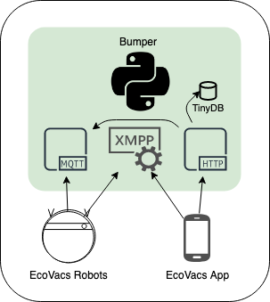

# Bumper 

Bumper is a standalone and self-hosted implementation of the central server used by Ecovacs vacuum robots.  Bumper allows you to have full control of your Ecovacs robots, without the robots or app talking to the Ecovacs servers and transmitting data outside of your home.

**Note:** The current master branch is unstable, and in active development.

## Build Status

| Master Branch | Status                                                                 |
| ------------------- | ---------------------------------------------------------------------- |
| AppVeyor (Win32)    |  |
| TravisCI (Linux)    |  |
| Docker Hub	      |  |
| CodeCov Coverage    |  |

**Community**:
A Gitter community has been created for Bumper so users can chat and dig into issues outside of Github, join us here:

***Testing needed***
Bumper needs users to assist with testing in order to ensure compatability as bumper moves forward!  If you've tested Bumper with your bot, please open an issue with details on success or issues.

***Please note**: this software is experimental and not ready for production use. Use at your own risk.* 

## Why?

For fun, mostly :)

But seriously, there are a several reasons for eliminating the central server:

1. Convenience: It works without an internet connection or if Ecovacs servers are down
2. Performance: No need for messages to travel to Ecovacs server and back.
3. Security: We can completely isolate the robot from the public Internet.
 
## Compatibility

As work to reverse the protocols and provide a self-hosted central server is still in progress, Bumper has had limited testing.  There are a number of EcoVacs models that it hasn't been tested against.  Bumper should be compatible with most wifi-enabled robots that use either the Ecovacs Android/iOS app or the Ecovacs Home Android/iOS app, but has only been reported to work on the below:

| Model           | Protocol Used | Bumper Version Tested | EcoVacs App Tested   |
| --------------- | ------------- | --------------------- | -------------------- |
| Deebot 900/901  | MQTT          | master                | Ecovacs/Ecovacs Home |
| Deebot 600      | MQTT          | master                | Ecovacs Home         |
| Deebot Ozmo 950 | MQTT          | master                | Ecovacs Home         |
| Deebot Ozmo 601 | XMPP          | master                | Ecovacs              |
| Deebot Ozmo 930 | XMPP          | master                | Ecovacs              |
| Deebot M81 Pro  | XMPP          | v0.1.0                | Ecovacs              |

## Documentation and Getting Started

See the documentation on [Read the Docs](https://bumper.readthedocs.io)

---
### Thanks
A big thanks to the original project creator @torbjornaxelsson, without his work this project would have taken much longer to build. 

Bumper wouldn't exist without [Sucks](https://github.com/wpietri/sucks), an open source client for Ecovacs robots. Thanks to @wpietri and contributors!
