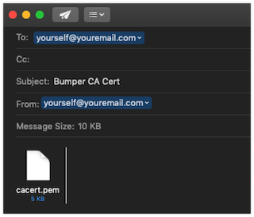
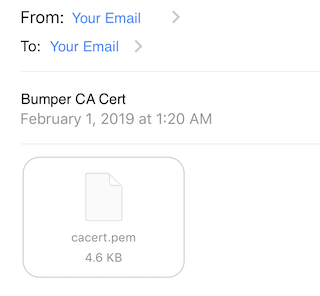
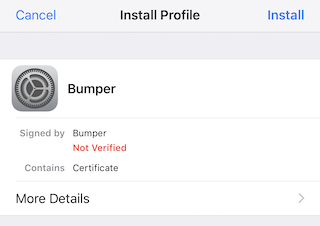
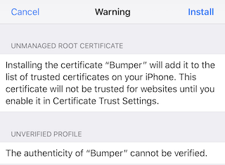
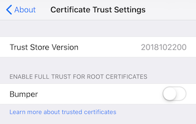
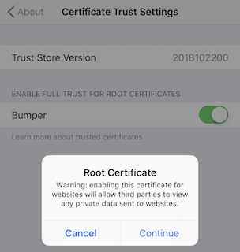

# Using Bumper with the official Android/iOS App 

Bumper *can* be used with the official "Ecovacs" or "Ecovacs Home" app, but with limitations. Your phone needs to use your DNS server with custom settings, and you ***must*** import Bumper's CA cert and trust it before the app will work.

**Steps**

1. Configure your DNS server as described above in the [DNS](DNS_Setup.md) doc
2. [Import the Bumper CA Cert](#import-the-bumper-ca-cert)
3. [Use the app](#use-the-app)

## Import the Bumper CA Cert

- E-mail yourself the Bumper CA cert (located at `./certs/CA/cacert.crt`)

**Note:** Make sure you select the `cacert.crt` file, which is a DER encoded version that will work on either Android or iOS.



- Import the cert as a CA, and trust it
	- Instructions for [iOS](#importing-the-ca-cert-on-ios)
	- Instruction for [Android](#importing-the-ca-cert-on-android)

----

### Importing the CA Cert on iOS

1. Open the e-mail on your iOS device, and click the attached cert


1. Install the profile by clicking "Install", and entering your pass code if prompted


1. Accept the certificate warning by clicking "Install" again


1. Click "Done" to exit the profile installation
1. Go to Settings > General > About
1. Scroll to the bottom and click "Certificate Trust Settings"
1. Enable Full Trust for the Bumper CA Cert, by moving the slider to the right



1. Click continue when prompted
1. That's it, you can now [Use the app](#use-the-app)

----

### Importing the CA Cert on Android

#### Android 7 and up (requires root)

Android 7 introduced changes to the certificate mechanism. See [blog entry](https://android-developers.googleblog.com/2016/07/changes-to-trusted-certificate.html).

> Apps that target API Level 24 and above no longer trust user or admin-added CAs for secure connections, by default.

To circumvent this problem, the certificate must be added as a system storage.

```bash
openssl x509 -in ca.crt -noout -text >> ca.crt

# restart adb as root
adb root
# remount /system rw
adb remount
# add certificate
adb push ca.crt "/system/etc/security/cacerts/$(openssl x509 -inform PEM -subject_hash_old -in ca.crt | head -1).0"
adb reboot
```

After reboot, verify that the certificate was added by checking `Settings > Security > Encryption & credentials > Trusted credentials > System`

#### Android 6 and below

1. Open the e-mail on your Android device

**Quick Method**

1. Click the cert, and if prompted provide a name
1. Under "Used for", select "VPN and apps"

**Long Method**

1. Save the attached cert file
1. Go to Settings > Lock screen and security > Other security settings
1. Under "Credential storage", click "Install from device storage"
1. Browse to the downloaded cert, select it, then click "Done"
1. Click the cert, and if prompted provide a name
1. Under "Used for", select "VPN and apps"

Now, start [using the app](#use-the-app).

----

### Use the app
 
 - Open the app
 - At this time there is no authentication layer, you can enter any e-mail address and password (as long as it is 6 characters) and you will be authenticated
 - If your robot has already checked into Bumper, then it will be available in the list of robots  
- The app now does a ping to the robot to make sure it is online, and if it is you can now control the robot
